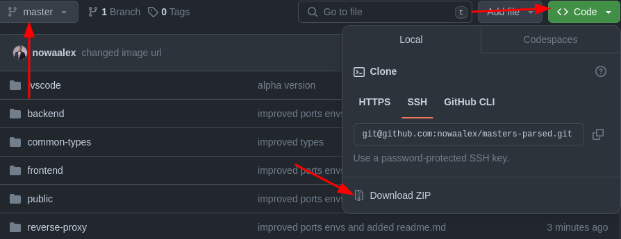

# Masters parser

This utility parses [https://masterspl.com/](https://masterspl.com/) website
with the help of [headless chrome](https://developer.chrome.com/blog/headless-chrome) and provides more beautiful matches statistics.

## Why it is not deployed?

1. I am lazy

2. Free hosting plans are too limited to run it

## Installation

1. Clone this repository (if you know how) **or** select `master` branch, download all files and extract downloaded archive
   

2. Open the folder with extracted files

3. Create empty file named `.env` and paste everything from `.env.template` into it

4. Install [docker](https://docs.docker.com/get-docker/)

5. Open console in the extracted archive directory

6. Run `docker compose build`

## Usage

1. Open console in the extracted archive directory

2. Run `docker compose up` and leave console opened

3. Open browser and go to "http://localhost"

4. To kill all running services press `Ctrl+C` in the console. After this console could be closed.
